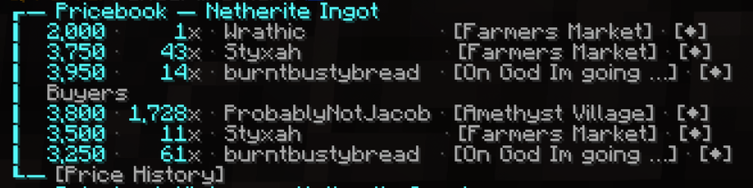

<h1 align="center">Pricebook ASMP</h1>

  

  

A player-friendly companion mod for the asmp.cc Minecraft server. Pricebook ASMP keeps track of player-run shops and waystones while you explore, then serves up instant answers through the `/pricebook` (or `/pb`) chat command.

## Features
- **Know before you go**: Type `/pricebook <item>` and see who is selling or buying it right now, along with prices and stock.
- **Waypoint shortcuts**: Click the coordinates in chat to drop a glowing waypoint overlay that guides you straight to the shop or waystone.
- **Automatic catch-up**: The mod scans loaded chunks for shop signs and updates the shared pricebook, so everyone benefits from your discoveries.
- **Waystone awareness**: Listings highlight nearby waystones, making fast travel part of your shopping run.

## How To Use It In-Game
1. Join the ASMP server with the mod installed.
2. Hold the item you’re curious about, or just think of its name.
3. Run `/pricebook` for the held item, or `/pricebook <item name>` to search directly.
4. Review the top buyers and sellers. Each entry shows price, amount, and how fresh the info is.
5. Click the coordinates or waystone link in chat to spawn an on-screen waypoint. Follow the marker; it auto-clears when you arrive.

> Tip: The shorter alias `/pb` works exactly the same, so you can type `/pb rockets` in a hurry.

## Quick Start (Installation)
1. Install Fabric Loader for Minecraft 1.21.7 or 1.21.8 and the matching Fabric API (they’re required by most ASMP mods).
2. Drop the latest `pricebook-asmp-<version>.jar` into your Minecraft `mods/` folder.
3. Launch the Fabric profile and hop onto `asmp.cc`. The mod enables itself automatically once you connect.

## Behind The Scenes
- The mod sends lightweight JSON updates about shops you’ve seen (owner, item, price, amount) plus optional waystone positions.
- Requests go to your configured Pricebook service (defaults to `http://localhost:49876` for development).
- A config file named `config/pricebook-asmp.json` is created on first run. You can toggle features like shop scanning or waystone tracking there.

## FAQ
- **Does it share my coordinates all the time?** Only when a shop sign or waystone is detected in a chunk you loaded, and only to the pricebook database.
- **Will it lag my client?** Scanning is lightweight and only happens as chunks stream in.
- **Can I use it on other servers?** It politely stays dormant unless the server address matches `asmp.cc`.
